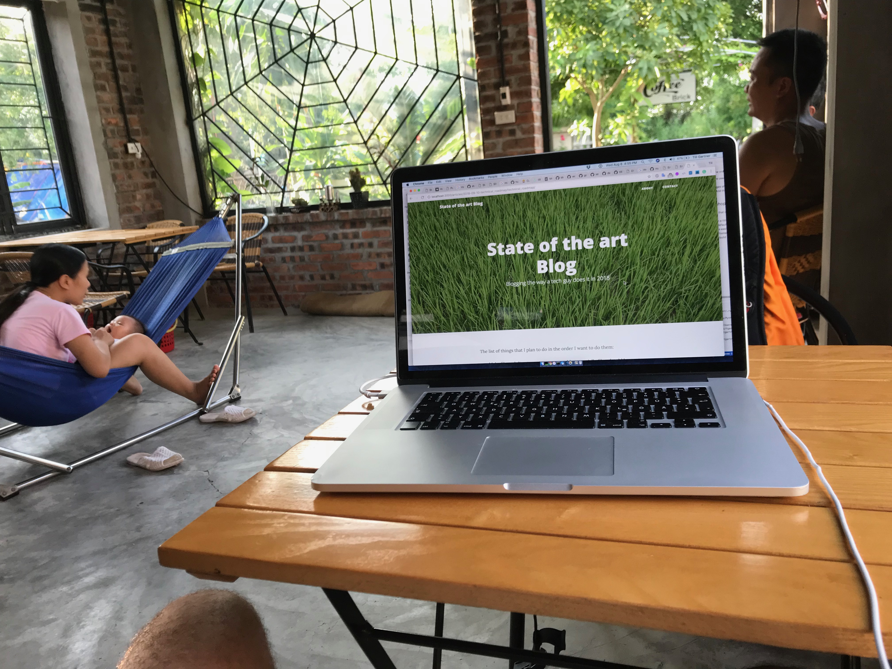

The list of things that I plan to do in the order I want to do them:

* Check the guide to set up a new blog site really works
* A first image management: Images should be shrinked in size if bigger than a threshold value. And they should link to the full resolution image.

## 2018-08-08 in a coffee shop in Tam Coc

* Start building checks to ensure that content cannot break the blog. Start with
  * Every article must contain a title, date, template
  * ...or fill those fields with default and produce warnings.
* Structured the pages in portions easier to handle: default is composed of header, main and footer.
* Added pages as templates and build a simple _About_ and _Contact_ page.
* Pages can now reside in sub directories just next to their images.
* Added a sitemap at [http://localhost:3000/sitemap.xml](http://localhost:3000/sitemap.xml)
* Added Google tracking

 